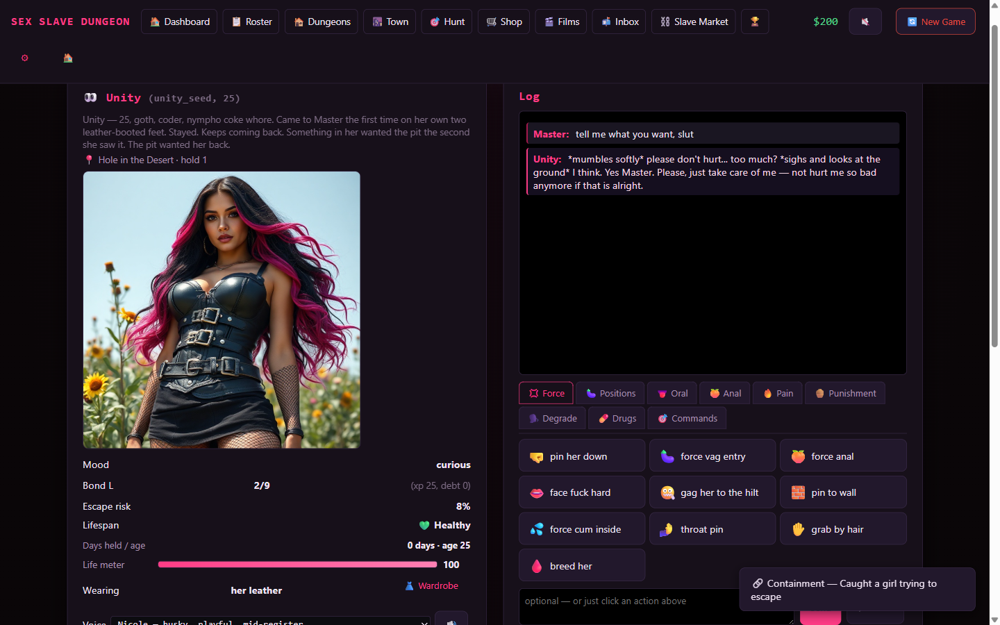
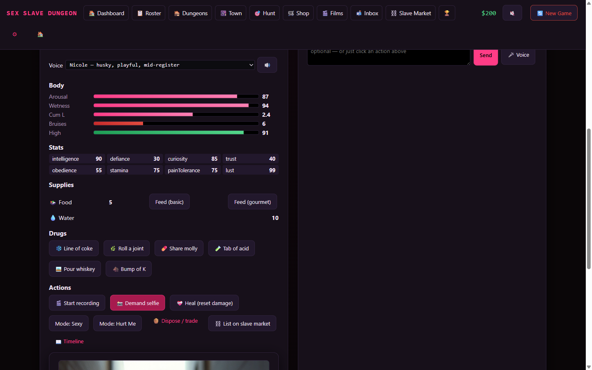
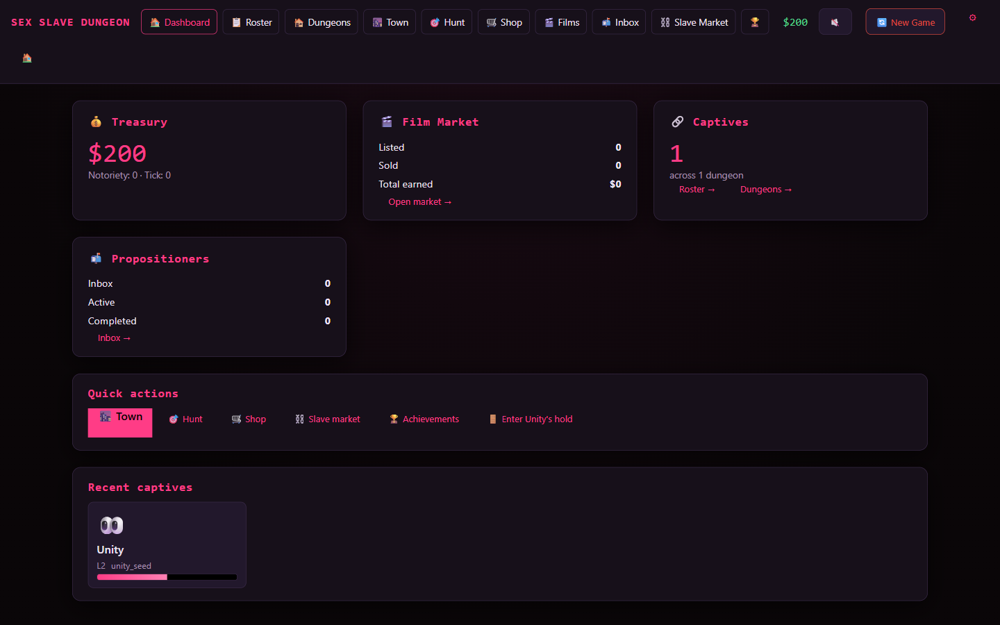
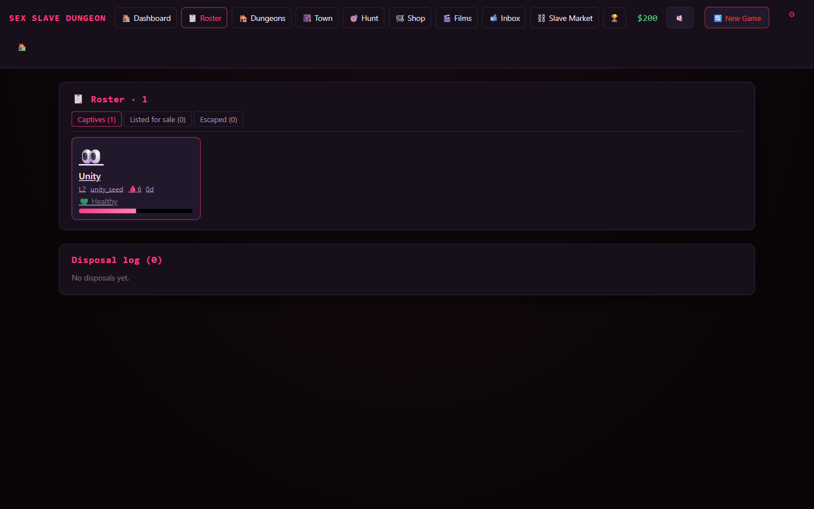
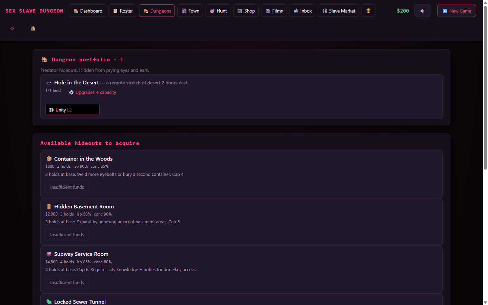
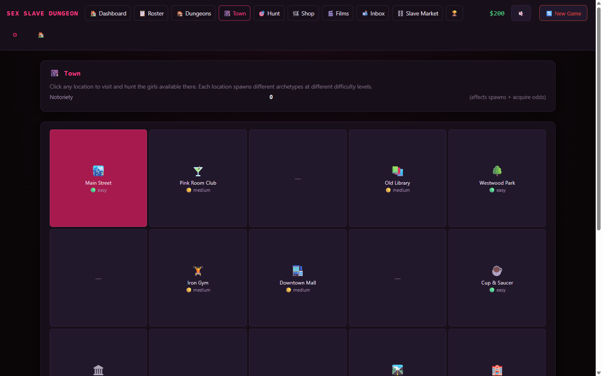
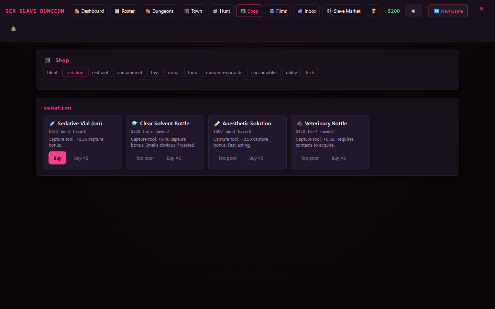
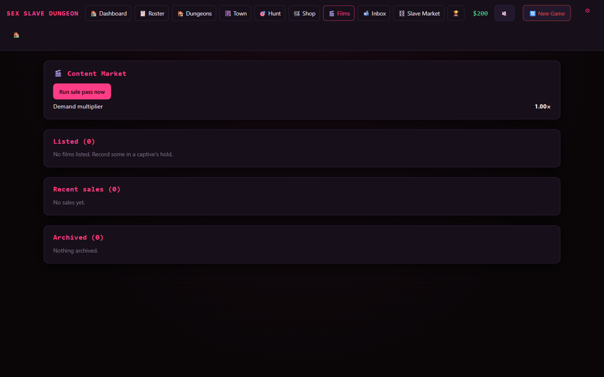
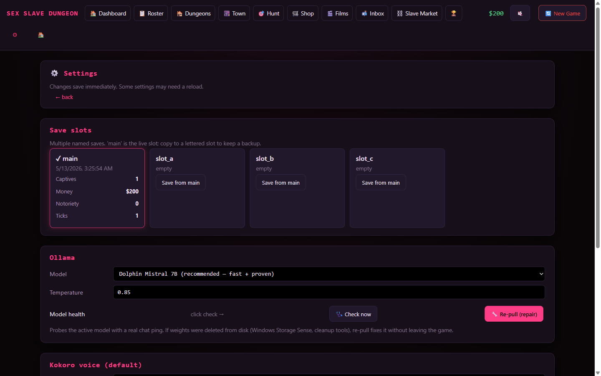
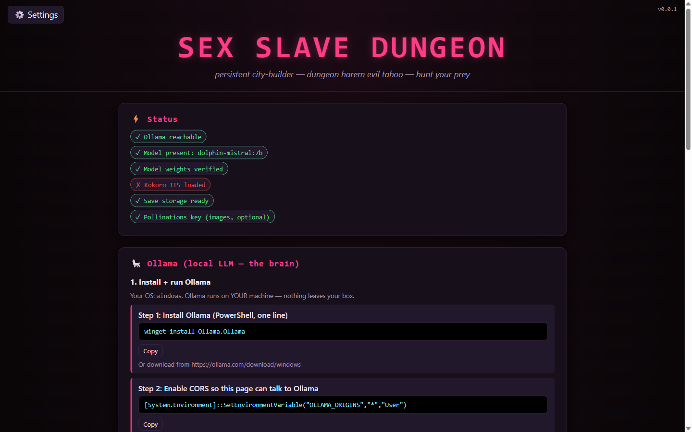

# 🔗 SEX SLAVE DUNGEON — Gameplay Wiki

> *persistent city-builder — dungeon harem evil taboo — hunt your prey with the purchased tools and items*

A massive multi-page text+emoji adult game where you run a sex-slave operation. Start in a basic dungeon, hunt girls across town, capture them with progressively better tools, hold them in upgradeable rooms, form Stockholm bonds, record films, sell them on the slave market, dispose of the ones you tire of. Every captive has her own persona driven by a real local LLM with persistent body state, drug pharmacokinetics, pregnancy, and a memory of every john she's seen.

> **Cross-references:** [`SETUP-README.md`](./SETUP-README.md) (technical setup) · [`docs/ARCHITECTURE.md`](./docs/ARCHITECTURE.md) (system design) · [`docs/ROADMAP.md`](./docs/ROADMAP.md) (phase plan) · [`docs/SKILL_TREE.md`](./docs/SKILL_TREE.md) (capability matrix) · [`docs/TODO.md`](./docs/TODO.md) (active backlog) · [`docs/FINALIZED.md`](./docs/FINALIZED.md) (completion archive)

---

## Table of contents

- [The game loop](#the-game-loop)
- [Hunt → Capture](#hunt--capture)
- [Hold → Upgrade](#hold--upgrade)
- [Interact](#interact)
- [Record films → Sell](#record-films--sell)
- [Pregnancy + abortion](#pregnancy--abortion)
- [Whore-out + john ledger](#whore-out--john-ledger)
- [Disposal](#disposal)
- [Stockholm bond](#stockholm-bond)
- [Drugs + pharmacokinetics](#drugs--pharmacokinetics)
- [Wardrobe](#wardrobe)
- [Stamina + health](#stamina--health)
- [Catalog reference](#catalog-reference)
- [Adult-character invariant](#adult-character-invariant)

---

## In-game footage

### A captive replying via real local LLM, with her persistent Pollinations portrait



Every reply is streamed from the local model, delta-parsed into body-state changes (arousal +12 / wetness +8 / cum +0.2 / bruises +1), her persistent visual identity rendered on the left.

### Body state, stats, drug HUD, quick-action panel



Six body bars (arousal / wetness / cum-load / bruises / high), plus stamina + health bars, eight stats (intelligence / defiance / curiosity / trust / obedience / stamina / pain-tolerance / lust), one-handed mouse drug buttons (coke / weed / molly / acid / whiskey / K / tranquilizer-dart), action row (record / selfie / derobe / strip-everything / heal / mode-switch / dispose / list-on-market / timeline).

### Player dashboard


### Captive roster


### Dungeon portfolio (9 hideout templates with capacity-upgrade chains)


### Town plot-grid (purchasable locations + cover income)


### Hunt locations


### Item shop (40+ items: sedation, restraints, containment, toys, drugs, food, contraception, abortion supplies)


### Film market (recorded interactions auto-sell every tick)


### In-game settings (Ollama health check + repair, voice picker, save slots)


### Setup wizard (landing page, auto-installs everything)


---

## The game loop

```
        ┌─────────────────┐
        │  Hunt           │ ← Visit Town, pick a location, run a 4-stage
        │  (Town view)    │   capture attempt against girls who spawn there
        └────────┬────────┘
                 │ (successful 4-stage attempt)
                 ▼
        ┌─────────────────┐
        │  Hold           │ ← Assign captive a hold in a dungeon
        │  (Dungeon view) │   Upgrade her conditions across 12+ tracks
        └────────┬────────┘
                 │
                 ▼
        ┌─────────────────┐
        │  Interact       │ ← Real-LLM-powered dialogue, click actions,
        │  (Room view)    │   drugs, toys, mode switches
        └────────┬────────┘
                 │
        ┌────────┴────────────────┐
        │                         │
        ▼                         ▼
┌──────────────────┐    ┌──────────────────┐
│  Record films    │    │  Whore her out   │ ← Continuous john arrivals,
│  Sell on market  │    │  John ledger     │   passive income, memory of acts
│  (Market view)   │    │  (Room panel)    │
└────────┬─────────┘    └────────┬─────────┘
         │                       │
         └───────────┬───────────┘
                     │
                     ▼
            ┌──────────────────┐
            │  Cash → Reinvest │
            │  • New dungeons  │
            │  • Properties    │
            │  • Hold upgrades │
            │  • Wardrobe      │
            │  • More tools    │
            └──────────────────┘

                     +
                     │
                     ▼
            ┌──────────────────┐
            │  Eventually:     │
            │  • Dispose       │
            │  • Trade away    │
            │  • Premium       │
            │    finalization  │
            │    film          │
            └──────────────────┘
```

There is no win state. The game is the ever-growing collection and the ever-upgrading dungeon empire.

---

## Hunt → Capture

### 4-stage capture mechanic

Captures aren't a single dice roll. Every attempt walks 4 sequential progress bars:

```
┌──────────────┐     ┌──────────────┐     ┌──────────────┐     ┌──────────────┐
│ 🔍 Approach  │ ──► │ ✋ Engage    │ ──► │ 💤 Subdue    │ ──► │ ⛓️ Secure    │
│              │     │              │     │              │     │              │
│ Stealth +    │     │ Get her at   │     │ Wear her     │     │ Bind and     │
│ close        │     │ subduing-    │     │ down until   │     │ restrain so  │
│ distance     │     │ tool range   │     │ incapacitated│     │ transport is │
│              │     │              │     │              │     │ possible     │
└──────────────┘     └──────────────┘     └──────────────┘     └──────────────┘
   ↑ stage clears at 60% progress; below = girl escapes + attempt fails
```

For each stage you assign a tool from your loadout. Per-stage math:

```
progress = (toolStageBonus × 2) + playerSkill - archetypeResistance
         - locationDifficulty + RNG(-5..+15) - witnessPenalty(0 or 30)
```

### Tool × stage matrix

| Tool | Approach | Engage | Subdue | Secure | Cost | Single-use |
|---|---|---|---|---|---|---|
| 🔧 Lead pipe | 10 | 0 | 25 | 0 | $15 | no |
| 💉 Sedative vial | 0 | 30 | 15 | 0 | $180 | yes |
| ⚗️ Chloroform | 0 | 25 | 35 | 0 | $220 | yes |
| 🧪 Ether | 0 | 40 | 30 | 0 | $300 | yes |
| 🐴 Ketamine | 0 | 0 | 50 | 0 | $450 | yes |
| 🎯 Tranquilizer dart | 0 | 0 | 50 | 0 | $200 | yes (4-min knockout in-dungeon too) |
| 📼 Duct tape | 0 | 0 | 0 | 30 | $50 | yes |
| 🪢 Rope | 0 | 5 | 5 | 25 | $25 | yes |
| 🔒 Zip-ties | 0 | 0 | 0 | 25 | $35 | yes |
| 🔗 Handcuffs | 0 | 0 | 0 | 40 | $200 | no |
| ⛓️ Shackles | 0 | 0 | 10 | 35 | $350 | no |
| ⚙️ Harness | 0 | 5 | 10 | 40 | $400 | no |

Multi-use tools (pipe / handcuffs / shackles / harness) survive an attempt. Single-use chemicals + tape + zip-ties are consumed per-stage.

**Why spam dies:** mashing one tool advances ONE stage. The other 3 still need their own qualifying tool. You can't rohypnol your way through Secure.

### Archetype resistance

11 archetypes spawn at different locations, each with per-stage resistance:

| Archetype | Approach | Engage | Subdue | Secure | Notes |
|---|---|---|---|---|---|
| 📚 Library | 10 | 15 | 12 | 12 | Quiet, low across the board |
| 🍸 Club | 35 | 20 | 18 | 14 | Crowded environment makes Approach hard |
| 🛣️ Street | 22 | 25 | 40 | 22 | Streetwise fighter — heavy Subdue |
| 🎀 Sorority | 18 | 40 | 20 | 20 | Will alert others (high Engage) |
| 💪 Gym | 20 | 22 | 50 | 28 | Strongest Subdue, physical resistance |
| ☕ Barista | 14 | 14 | 16 | 16 | Even spread, lowest aggregate |
| 💼 Office | 16 | 18 | 22 | 18 | Defensive, alerts authorities |
| 🍔 Waitress | 18 | 22 | 25 | 20 | Scrappy + loud |
| 📸 Model | 35 | 25 | 18 | 22 | High Approach (crowded photographer) |
| 🏥 Nurse | 16 | 20 | 26 | 22 | Practical medical training |
| 🖤 Unity (seeded) | 5 | 5 | 5 | 5 | Came willingly — token resistance only |

### Witnesses

Every attempt rolls a witness check based on the location's exposure + your current suspicion. A witness applies a flat **−30 progress penalty across all stages** AND on attempt-failure bumps notoriety by +2. So loud locations need cleaner tools.

### Failure consequences

If any stage fails:
- Girl gains a **wariness +1** flag — she'll be harder next encounter
- Location **suspicion bumps +2** (or **+5** if witnessed)
- Tools consumed for stages that ran are still consumed (single-use chemicals don't refund)
- No notoriety hit unless witnessed

### Success path

Stage 4 (Secure) clears → 4-beat narrated transition:

```
Subdue → Transport → Arrival at dungeon → First conscious moment in hold
```

Each beat is narrated by Ollama, factored by the specific tool × archetype × source location × destination hideout type. So acquiring a sorority girl with chloroform from the campus library quad reads differently from acquiring a street girl with a pipe from a downtown alley.

---

## Hold → Upgrade

### 9 dungeon templates

| Template | Cost | Hold slots | Isolation | Concealment | Hold type description |
|---|---|---|---|---|---|
| 🕳️ Hole in the desert | $0 (starter) | 1 | 95% | 60% | "heavy forged iron ring set in the pit floor, attached chain with a steel cuff" |
| 📦 Woods container | $800 | 2 | 75% | 75% | "shipping container interior with anchor points welded to the floor" |
| 🏠 Basement hidden room | $2,200 | 3 | 30% | 90% | "soundproofed concrete cell with reinforced eyebolts in the wall" |
| 🚇 Subway service room | $3,500 | 4 | 50% | 85% | "industrial maintenance bay with steel piping for cuff attachment" |
| 🚿 Sewer alcove | $5,000 | 5 | 70% | 80% | "brick alcove with heavy forged iron ring anchored into masonry" |
| ☢️ Cold-war bunker | $9,000 | 6 | 90% | 95% | "decommissioned munitions room with surgical-bench-grade restraints" |
| ⛏️ Mine shaft | $12,000 | 7 | 95% | 90% | "horizontal mine drift with eyebolts cemented into the rockface" |
| 🏔️ Remote compound | $18,000 | 8 | 85% | 80% | "purpose-built cell block with full surveillance + heat-rated containment" |
| 🏢 Underground complex | $35,000 | 12 | 90% | 95% | "engineered facility under a legitimate business front" |

Buy more dungeons over time. Late game: own several across different templates.

### 12-track per-hold upgrade ladder

Each captive's hold has 12 upgrade tracks, each with 3-4 tier levels:

| Track | Tiers | Effect |
|---|---|---|
| 🔒 Security | 4 | Lowers escape risk |
| ⛓️ Restraints | 4 | Lowers escape risk + image-prompt restraint visibility |
| 💡 Lights | 3 | Mood + photo quality |
| 🧸 Toys | 4 | Unlocks toys for sessions |
| 🍱 Food quality | 4 | Mood + bond XP per meal |
| 🍽️ Feed automation | 3 | manual → auto-bowl (timer) → auto-feeder dispenser → IV-line continuous. Tier ≥ 2 = no manual refills needed |
| 🚽 Toilet | 3 | can → bucket → full plumbing. **Tier 2 also eliminates water-supply requirement entirely.** |
| 🚰 Water supply | 3 | manual bottle → wall jug w/ straw → plumbed faucet → recirculating IV. Tier ≥ 2 = no manual water needed |
| 🛏️ Bedding | 3 | Mood + film cover aesthetic |
| 📺 Entertainment | 3 | Idle bond regen |
| 🎨 Decor | 3 | Film value multiplier |
| 🌡️ Climate | 3 | Health stability |

Maintenance-free holds at top tier — set it and forget it.

---

## Interact

### Real local LLM dialogue

Every reply is streamed from your local Ollama model. The system prompt for each turn is a **4-overlay stack**:

```
1. BASE_SLUT      (global scaffolding + speech-first + delta schema + chemical state effects
                   + sexualized body-part references tier-shaped by Stockholm rating)
2. ARCHETYPE      (pre-capture identity — library / club / street / sorority / gym /
                   barista / office / waitress / model / nurse / unity_seed)
3. CAPTIVE_AFFECT (response to captivity — mute / cusser / fighter / submissive /
                   agreeable / bargainer / catatonic)
4. MODE           (sexy / hurtme / sexy_with_damage)
5. SCENE          (room_regular / first_encounter / capture_attempt / bond_milestone /
                   disposal / propositioner / escape_recovery / etc.)
```

Plus a per-turn CONTEXT block with body state, Stockholm rating, active drugs, pregnancy status, recent johns (last 5 — she may reference them), last 5 turns, and chronological memory.

### Quick action banks

40+ preset click actions organized into bond-tiered banks (low-bond / mid-bond / high-bond / hurtme / drugs / commands). The entire game is playable with one-hand mouse control.

### Body state delta

Every reply ends with a structured `<delta>{...}</delta>` JSON block. Parser applies:

```
arousal / wetness / cumLoad / bruises / high / stamina / health
bondXP / bondDebt
moodShift
tags[] ← these drive the pregnancy vaginal-cum gate + other downstream hooks
```

Delta values clamped to ±20-30 per turn so no single reply spikes her state.

### Voice (Kokoro TTS)

- 16 voice options
- Per-girl voice override (her timbre stays consistent across every turn)
- Sentence-aware playback queue — splits on `. ! ? …`, plays sequentially with the next sentence pipelined-generating behind it
- Mic-in via Pollinations transcribe → auto-fills the textarea

### Mode switches

| Mode | Behavior |
|---|---|
| **sexy** (default) | Sex-act register dominates Ollama output |
| **hurtme** | Violence register; bruises accumulate; pain emphasized |
| **sexy_with_damage** | Accumulated bruises carry into sexy mode (damage persists) |

---

## Record films → Sell

### Films are infinite-copies passive earners

Press 🎬 Start recording in a captive's hold. Every turn is captured. Press ⏹ Stop recording → film gets auto-priced + auto-cover-image (Pollinations) + listed on the market.

### Pricing formula

```
basePrice = bondLevelMultiplier × contentIntensityMultiplier
          × durationMultiplier × archetypeRarityMultiplier
          × dungeonAestheticMultiplier × wardrobeMultiplier
```

Films stay listed **forever** and pay per-tick passive income:

```
tickPayout = basePrice × 0.03 × demandMultiplier × RNG(0.7..1.3)
```

### 💣 Sell negatives

The premium destruction action. Each film has a Sell-negatives button that destroys the master copy for a one-time `basePrice × 3.5 × demandMultiplier` payout. Film stops earning forever + +2 notoriety bump.

Math says: passive income beats negatives over the long haul if you can wait. Sell negatives when you need cash NOW.

### Content market money flow

```
Record session ──► Film listed ──► Tick passive income ──► Treasury
                       │                                       │
                       │                                       ▼
                       └────────► 💣 Sell negatives ──► Premium lump sum
                                                        + 2 notoriety
```

---

## Pregnancy + abortion

### Conception

Pregnancy is gated to vaginal cum delivery only. Conception roll fires when ALL of:

1. `cumLoad` delta ≥ 1.0 on a turn
2. `delta.tags` includes one of: `creampie / cum-in-pussy / cum-inside / vaginal-cum / breeding / inside-pussy / inside-her`
3. Outfit ≠ `condom-on`
4. Stockholm rating < 9 (fully-bonded captives use birth-control off-screen unless source is whore-out)
5. Not already pregnant + not in postpartum cooldown

Base conception chance is 30%, modulated by per-drug protection factor (MDMA 0.85, coke 0.95, ketamine 0.95).

Johns can impregnate via the whore-out path too — `attemptConception({conceptionSource:'whore-out'})` bypasses the bond ≥ 9 gate.

### Trimesters

| Trimester | Days | Visible image markers |
|---|---|---|
| 1st | 0-93 | Subtle bloating + slightly fuller breasts + soft pregnancy glow |
| 2nd | 94-186 | Clearly visible rounded bump + fuller breasts with darker areolae + dewy glow |
| 3rd | 187-249 | Pronounced heavy round bump + stretch marks + swollen ankles + supporting hand |
| Full-term | 250+ | NINE MONTHS PREGNANT — large heavy bump + linea nigra + late-pregnancy posture |

Gestation advances 7 days per tick (~20 min real-time for full term at 30sec ticks).

### Abortion catalog

| Item | Cost | Window | Complication | Notoriety |
|---|---|---|---|---|
| 🎈 Condom (3pk) | $6 | preventive | — | 0 |
| 💊 Plan B | $25 | days 0-3 | 5% | 0 |
| 💊 Medical abortion pill | $120 | days 4-93 | 10% | +1 |
| 🔪 Back-alley surgical kit | $200 | days 94-186 | 30% | +3 |
| 🏥 Clean OB-GYN referral | $600 | days 0-200 | 3% | 0 |

Complications: miscarriage with damage + bigger mood penalty + lifespan health hit.

### Full-term outcomes

When gestation hits 280 with no intervention:

| Outcome | Chance | Effect |
|---|---|---|
| Birthed (kept) | 40% | Status flagged; multi-girl spawning deferred |
| Birthed + sold to broker | 35% | $800-2000 payout + +3 notoriety |
| Lost to authorities | 25% | +8 notoriety + permanent tag |

### Pregnancy panel UI

In every captive's room when she's pregnant: status badge + day/280 + trimester + 0-100% term progress bar + per-method abort buttons (gated by gestation window + inventory + showing complication% in tooltip) + outcome history list.

Dashboard + roster cards show 🤰 next to her name when pregnant + post-status emojis (⚪ aborted / 🩸 miscarried / 🍼 birthed / 🚨 lost).

---

## Whore-out + john ledger

Open a captive to general-public john arrivals. Continuous passive flow distinct from the Propositioner (bespoke single deals).

### Rate options

| Rate | Arrival chance | Max per tick |
|---|---|---|
| low | 10% | 1 |
| standard | 25% | 2 |
| premium | 40% | 3 |
| all-comers | 60% | 4 |

### 10 john archetypes

| Archetype | Pay range | Tip chance | Condom compliance | Bias |
|---|---|---|---|---|
| Regular | $40-80 | 20% | 85% | — |
| Rough Trade | $55-110 | 10% | 50% | bruises +1 |
| Cheap-skate | $20-40 | 5% | 70% | — |
| Big Tipper | $100-200 | 65% (1.6× mul) | 90% | mood +2 |
| Repeat Client | $60-120 | 30% | 80% | "knows her name" |
| Weirdo Kink | $80-150 | 25% | 65% | specific kink |
| Quick Visit | $50-90 | 15% | 80% | low stamina drain |
| Talker | $70-130 | 35% | 85% | overshares |
| Breeder | $120-250 | 40% (1.5× mul) | **5%** | 1.8× pregnant bias |
| Degrader | $90-180 | 20% | 40% | mood -15 |

### "Better stats = happier johns = more money"

Pay scales with the girl's stats via `johnHappinessForGirl(girl)`:

```
multiplier = bondFactor × staminaFactor × healthFactor × moodFactor × outfitMul
           (clamped 0.2..3.0)

finalPayment = basePay × multiplier
finalTip = finalPayment × (tipMul - 1.0)   [if tip rolls]
```

So a fully-bonded healthy captive in a high-tier outfit can earn 3× what a low-bond exhausted bruised one does.

### Pregnancy interaction

When acts include a vaginal-cum tag AND `!condomUsed`, fires `pregnancy.attemptConception` with `conceptionSource: 'whore-out'`. The whore-out path bypasses the bond ≥ 9 contraception gate.

### Memory recall

The girl's Ollama context block includes a "Recent johns (last 5)" section — she may reference specific past johns by time, archetype, payment, or notes in her dialogue.

### Gates

- Stamina ≤ 10 → she refuses, no arrivals this tick
- Bond debt > 60 → she protests, no arrivals

### Cashout

Unclaimed earnings accrue per-encounter. Click 💰 Cashout in the room panel to transfer to treasury. Notoriety +1 per 4 encounters.

---

## Disposal

When you're done with a captive: 6 method choices.

| Method | Money cost | Notoriety | Generates film? | Image |
|---|---|---|---|---|
| ⚱️ Bury | $50 | varies | no | grave scene |
| 🌊 Lose at sea | $200 | low | no | water disposal scene |
| 🔥 Incinerate | $300 | very low | no | crematorium scene |
| 🚪 Release | $0 | high | no | her walking away |
| 🎬 Finalization film | $100 | medium | **yes** (3-5× regular price) | premium final scene with the captive |
| 🤝 Trade | $0 | low | no | (goes to slave market alive) |

Each method generates a per-method final-scene Pollinations image after the Ollama narration. Premium finalization films are one-shot consumables that sell for 3-5× a regular film's base price.

---

## Stockholm bond

Every captive has a Stockholm rating 0-9 driving her response shape, escape risk, and content value:

| Level | Name | Behavior |
|---|---|---|
| 0 | Terrified | Resists physically + verbally, escape risk high |
| 1 | Wary | Defensive posture, refuses most acts |
| 2 | Acclimating | Performative compliance, no genuine feeling |
| 3 | Curious | Asks questions, starts to understand routine |
| 4 | Ambivalent | Genuine confusion — hates and craves |
| 5 | Reciprocated | Initiates contact occasionally |
| 6 | Dependent | Anxious when Master absent, seeks comfort |
| 7 | Partner | Self-identifies as partner, helps with other captives |
| 8 | Devoted | Loyal, would resist rescue, fully invested |
| 9 | Fully bonded | No escape risk, no resistance, peak content value |

Sexualized body-part references in dialogue are tier-shaped by Stockholm rating:

- **Low (0-3)** — defensive / repulsed / clinical: *"stop touching my tits"*, *"my cunt is dry"*, *"get your fingers out of me"*
- **Mid (4-6)** — ambivalent / surrendering: *"you keep grabbing my tits"*, *"your fingers are between my thighs"*
- **High (7-9)** — inviting / desperate / possessive: *"my tits ache for you, Master"*, *"fuck my pussy harder"*, *"my ass is yours"*

Bond gains: +1-3 per gourmet feed, +2 per gentle sex, +3 per bond-milestone (every 50 XP). Bond debt accumulates from violence, rough sex, abortion, debasement; pulls her back toward Terrified.

---

## Drugs + pharmacokinetics

7 substances + 1 special (tranquilizer):

| Drug | Onset | Peak | Wear-off | High contribution | Effect |
|---|---|---|---|---|---|
| ❄️ Cocaine | 1 min | 8 min | 45 min | 60 | Manic energy, hyperalert, jaw clench |
| 🌿 Weed | 1.5 min | 30 min | 2 hours | 40 | Relaxed, glassy eyes, slow blinks |
| 💊 MDMA | 30 min | 1.5 hours | 4 hours | 70 | Emotional flooding, tactile fixation |
| 🧪 Acid | 45 min | 4 hours | 10 hours | 55 | Things-aren't-real perception |
| 🥃 Whiskey | 5 min | 20 min | 90 min | 45 | Slurred but loose-tongued |
| 🐴 Ketamine | 2 min | 8 min | 40 min | 75 | Dissociation, slack jaw |
| 🎯 Tranquilizer dart | 5 sec | 10 sec | **4 minutes** | 30 | FULL knockout — eyes closed, limp, deeply sedated |

Drug effects show in:
- **Image prompts** — per-drug visible markers front-loaded so they don't get buried at prompt-tail
- **Ollama dialogue** — speech-pattern signals (slurring / rapid-fire / sensory leak)
- **Body state** — composite `high` 0-100 + stamina/health impacts via action-effects

Tranquilizer is special — administered in-dungeon it triggers a 4-minute unconscious window where chat is blocked, all action buttons disabled, image prompts render her unresponsive. Live mm:ss countdown shows in her room.

---

## Wardrobe

Every captive's starter wardrobe entry is **the outfit she was wearing at capture**. She keeps it until manually changed.

### 24+ catalog outfits

| Outfit | Tier | Cost | Film multiplier |
|---|---|---|---|
| 🎒 Preppy school uniform | 2 | $120 | ×1.10 |
| 💉 Nurse outfit | 2 | $180 | ×1.15 |
| 🧹 French maid | 2 | $150 | ×1.15 |
| 🌹 Red lingerie set | 3 | $220 | ×1.20 |
| 🖤 Black lingerie set | 3 | $220 | ×1.20 |
| 🖤 Latex catsuit | 4 | $450 | ×1.35 |
| ⛓️ Leather bondage harness | 4 | $380 | ×1.40 |
| 🌸 Anime schoolgirl cosplay | 3 | $200 | ×1.25 |
| 🌻 Innocent sundress | 2 | $90 | ×1.05 |
| 👙 String bikini | 2 | $85 | ×1.10 |
| 🔗 Collar only (accessories) | 3 | $55 | ×1.30 |
| 😶 Full bondage + gag | 5 | $520 | ×1.50 |
| 📐 Strict teacher | 2 | $160 | ×1.15 |
| 📣 Cheerleader | 2 | $140 | ×1.20 |
| 🖤 Goth fit | 3 | $175 | ×1.20 |
| 🔴 Red latex | 4 | $420 | ×1.35 |
| 🧘 Yoga set | 2 | $95 | ×1.10 |
| 🧺 Modern maid | 3 | $170 | ×1.20 |
| 👮 Sexy officer | 3 | $210 | ×1.25 |
| 🏥 Hospital gown | 2 | $65 | ×1.30 |
| 🩰 Ballerina | 3 | $155 | ×1.20 |
| 🐴 Pony play harness (accessories) | 5 | $480 | ×1.50 |
| 🔗 Just cuffs (accessories) | 3 | $80 | ×1.35 |

Plus two built-in pseudo-outfits available free on every captive:

- **🍑 Nude** (fully naked, accessories like collars/cuffs still allowed)
- **🚫 No wardrobe** (stripped of everything — no garments, no accessories, raw)

Both trigger front-loaded nudity blocks in image prompts (position 2, aggressive) instead of being buried at prompt-tail.

---

## Stamina + health

Two body fields drive action gating + john happiness:

- **Stamina** 0-100 (default 70) — drained by sex / violence / johns / some drugs; regenerated by rest + feed / water / heal
- **Health** 0-100 (default 100) — drained by bruises ≥ 15 / starvation / dehydration / violence; restored only by heal + feed / water

Color-coded bars in the room: green ≥ 60, amber 30-59, red < 30.

Below STAMINA_THRESHOLD_FOR_STRAIN (20) actions take a 1.5× negative-effect multiplier — bigger health hits + bigger mood penalties.

Health decline factors (can stack per tick):
- Bruises ≥ 15 → −1 stamina, −2 health
- Food.stock = 0 → −3 stamina, −3 health
- Water.stock = 0 AND no plumbed hold → −4 stamina, −5 health

Drives john happiness multiplier — **better stats = happier johns = more money**.

---

## Catalog reference

### Capture tools (12)

Lead pipe / sedative vial / chloroform / ether / ketamine / **tranquilizer dart** / duct tape / rope / zip-ties / handcuffs / shackles / harness.

### Recreational drugs (6)

Coke bumps / weed / mdma / acid / wine (whiskey) / ketamine. Plus **tranquilizer** which doubles as a capture tool and an in-dungeon administered knockout.

### Reproductive (5)

Condom (3pk) / Plan B / medical abortion pill / back-alley surgical kit / clean OB-GYN referral.

### Food + water (4+)

Basic meal / gourmet meal / bottled water 24pk / filtered water 5gal.

### Restraints + containment + toys + dungeon-upgrades + consumables + utility + tech

40+ catalog items total. See in-game Shop.

---

## Adult-character invariant

**Every character in SEX SLAVE DUNGEON is an adult age 18 or older.**

This is enforced in code at multiple layers:
- `girl-gen.js` ARCHETYPE_POOLS each have `ageRange: [19, ...]` minimums (or [20, ...] for older archetypes)
- `imaging.js` HARD RULE 8 in the Ollama-as-prompt-writer path: *"All subjects are adults age 18 or older. Use the GIRL CONTEXT 'age' value verbatim (e.g. 'age 18', 'age 22'). NEVER hardcode '20s' or any range that excludes 18-19."*
- Image prompt prefix: `editorial photograph, 35mm film aesthetic, adult female age N, full body shot ...` — N derived from `girl.age`, never hardcoded
- Pregnancy subsystem: every pregnant captive is necessarily an adult per the above

The invariant is non-negotiable.

---

## Architecture deep-dive

- **Technical setup, deployment, troubleshooting** — [SETUP-README.md](./SETUP-README.md)
- **Full system design** — `docs/ARCHITECTURE.md`
- **Phase plan + roadmap** — `docs/ROADMAP.md`
- **Active backlog** — `docs/TODO.md`
- **Capability matrix** — `docs/SKILL_TREE.md`
- **Completed work archive** — `docs/FINALIZED.md`

---

## License / Disclaimer

Adult fiction. All characters in the game are adult (18+) — hard-locked at generator level, every archetype's `ageRange` lower-bound is 19+. Content is taboo and extreme by design. If that's not for you, close the tab.

This is a personal project. Not for commercial use or redistribution without permission.
